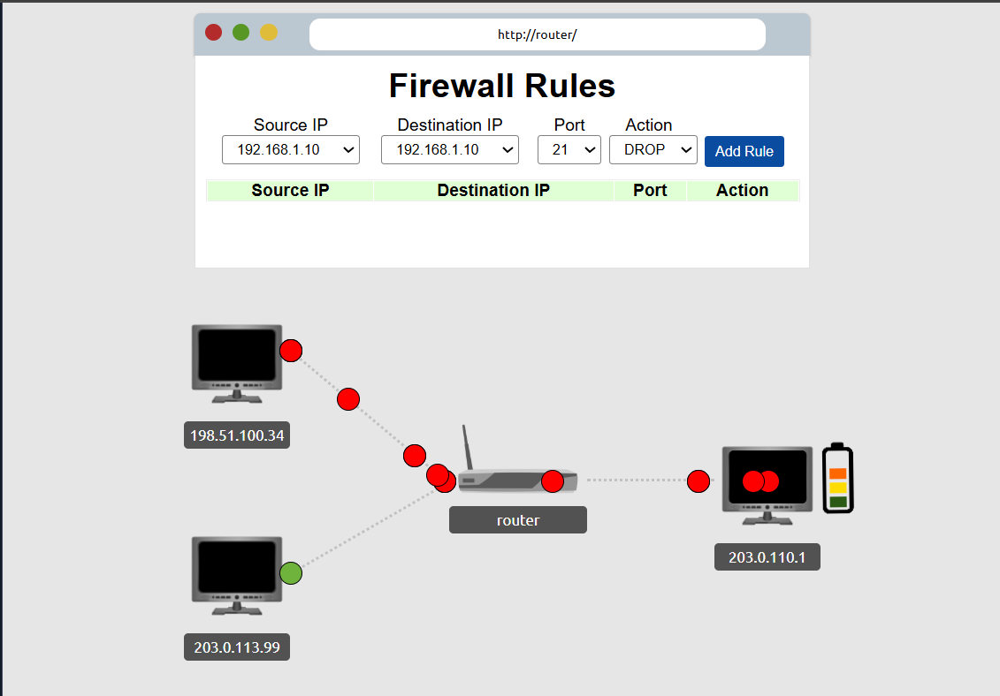
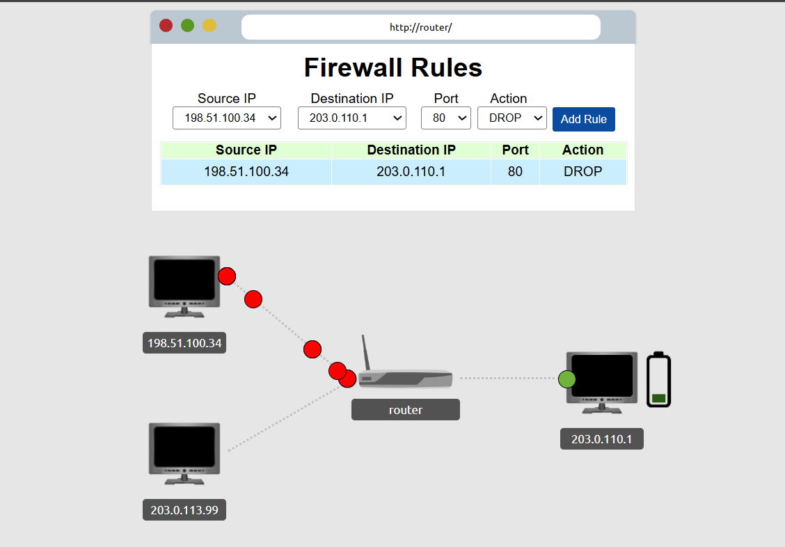
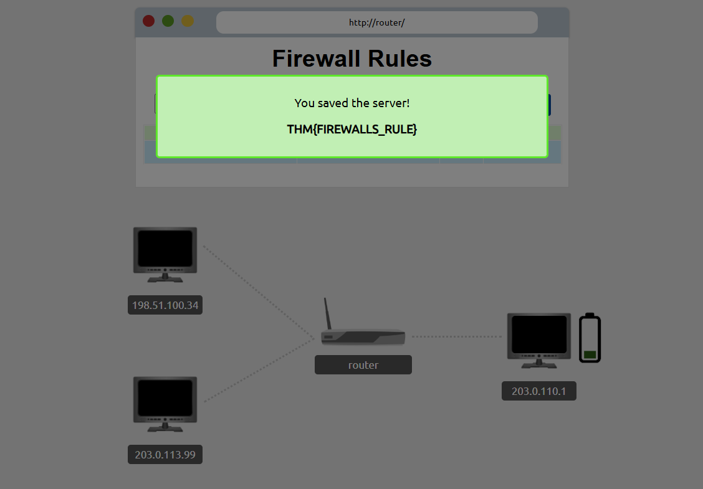

# Lab - Firewall Rules

## Sobre o laboratório

Este laboratório teve como objetivo praticar a criação de regras de firewall para bloquear tráfego malicioso direcionado a um servidor.

Durante a atividade, foi simulado um ataque contra o servidor `203.0.110.1`, onde o tráfego suspeito partia do IP `198.51.100.34`.

## Cenário

- Servidor alvo: `203.0.110.1`
- IP atacante: `198.51.100.34`
- Porta utilizada: `80`
- Ação aplicada: `DROP`

## Regra aplicada

| Source IP | Destination IP | Porta | Ação |
|----------|----------------|-------|------|
| 198.51.100.34 | 203.0.110.1 | 80 | DROP |

## O que foi feito

1. Identifiquei o tráfego malicioso vindo do IP atacante.
2. Analisei o destino do ataque.
3. Criei uma regra de firewall bloqueando a comunicação.
4. Validei que o servidor foi protegido com sucesso.

## Evidências

### Servidor sob ataque

### Regra de firewall aplicada

### Servidor protegido

## Aprendizados

Com esse laboratório, consegui reforçar conceitos importantes para a área de Cibersegurança, principalmente voltados para SOC / Blue Team:

- Identificação de tráfego suspeito
- Análise de IP de origem e destino
- Criação de regras de firewall
- Bloqueio de tráfego malicioso
- Proteção da disponibilidade de um servidor

## Tecnologias e conceitos praticados

- Redes de computadores
- Firewall
- Regras de bloqueio
- Tráfego HTTP
- Segurança defensiva
- Blue Team